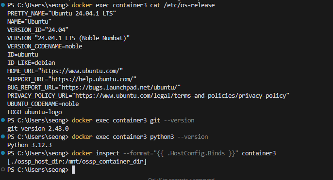

# SWE_2021_41_2024_2_week_6
---
## Week 4 Assignment
+ [Repository Link](https://github.com/gatosopa/SWE_2021_41_2024_2_week_4/tree/main)

```python
def isHappy(n):
  mem = set()
  while n != 1:
    if n in mem:
      return False
    mem.add(n)
    n = sum(int(i)**2 for i in str(n))

  return True
```
+ The function takes a number n as input and determines whether n is a happy number by repeatedly replacing the number with the sum of the squares of its digits. The sum of the digits is computed by type-casting the number into a string to iterate over the digtis (chars). The function runs a loop until n=1 -- returns True-- or a loop is detected due to it encountering a previously computed number (stored in a set) -- returns False.
---
## Week 5 Assignment
>```shell
>docker exec <your container> cat /etc/os-release
>```
>+ Prints the contents of os-release file.
>```shell
>docker exec <your container> git --version
>```
>+ Checks the git version installed in the container.
>```shell
>docker exec <your container> python3 --version
>```
>+ Checks the python version installed in the container.
>```shell
>docker inspect --format="{{ .HostConfig.Binds }}" <container_name>
>```
>+ Inspects container and extracts mount points.
> ### Outputs
>>
